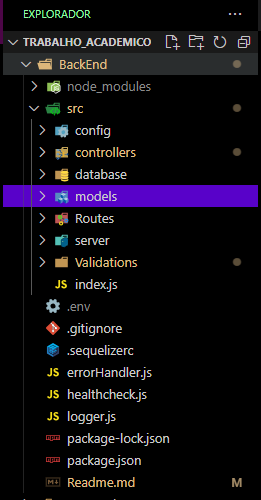
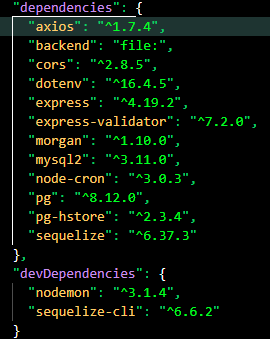

# Trabalho acadêmico de extensão - Projeto banco de dados!

## Tecnologias utilizadas!
<ul>
    <li>React</li>
    <li>PostgresSQL</li>
</ul>

## Estrutura BackEnd

## EndPoints Back End
 

 ## Dependências instaladas
 
 
Para o projeto rode corretamenta em sua maquina localhost, instale as Dependências com o comando  
npm install

## Rodando em servidor local 
http://localhost:300

## EndPoints para consultas ao DB
Todos http://localhost:3000/

## Categorias
 ### Metodos POST 
http://localhost:3000/api/categorias - 
- Header: key: Content-Type  value: application/json  
- body: 
{
  "nome": "Salgados"
}

 ### Metodos GET 
http://localhost:3000/api/categorias - RETORNA TODOS OS VALORES  
http://localhost:3000/api/categorias/:id - RETORNA APENAS O VALOR RELACIONADO AO ID   

## produtos
 ### Metodos POST 
http://localhost:3000/api/produtos - 
- Header: key: Content-Type  value: application/json  
- body: 
{
  "nome": "Pastel",
  "descricao": "Pastel de frango",
  "preco_compra": 0.50,
  "preco_venda": 2.00,
  "unidade_de_medida": "150g",
  "id_categoria": 1
}

 ### Metodos GET 
http://localhost:3000/api/produtos - RETORNA TODOS OS VALORES  
http://localhost:3000/api/produtos/:id - RETORNA APENAS O VALOR RELACIONADO AO ID   

 
## Estoques
 ### Metodos POST 
http://localhost:3000/api/estoques - 
- Header: key: Content-Type  value: application/json  
- body: 
{
  "id_produto": 1,
  "quantidade_minima": 10,
  "quantidade_atual": 100
}

 ### Metodos GET 
http://localhost:3000/api/estoques - RETORNA TODOS OS VALORES  
http://localhost:3000/api/estoques/:id - RETORNA APENAS O VALOR RELACIONADO AO ID   

## Movimentaçoes de Estoques
 ### Metodos POST 
http://localhost:3000/api/movimentacoes - 
- Header: key: Content-Type  value: application/json  
- body: 
{
  "tipo_movimentacao": "Entrada",
  "id_estoque": 1,
  "quantidade": 20,
  "data_movimentacao": "2024-08-29T12:00:00Z",
  "id_produto": 1
}

 ### Metodos GET 
http://localhost:3000/api/movimentacoes - RETORNA TODOS OS VALORES  
http://localhost:3000/api/movimentacoes/:id - RETORNA APENAS O VALOR RELACIONADO AO ID   

## Usuarios 
 ### Metodos POST 
http://localhost:3000/api/usuarios
- Header: key: Content-Type  value: application/json  
- body: 
{
  "nome": "Henrique",
  "email": "henrique@example.com",
  "senha": "senhaSegura123",
  "status": true,
  "id_role": 1
}

 ### Metodos GET 
http://localhost:3000/api/usuarios - RETORNA TODOS OS VALORES  
http://localhost:3000/api/usuarios/:id - RETORNA APENAS O VALOR RELACIONADO AO ID   

### Metodos PUT 
http://localhost:3000/api/usuarios/:id - RETORNA APENAS O VALOR RELACIONADO AO ID   
- Header: key: Content-Type  value: application/json  
- body: 
{
    "nome": "Geilson",
    "email": "geilsonf@gmail.com",
    "senha": "123456", 
    "status": true,
    "roles": [1] 
}

## Role - Papeis dos Usuarios 
 ### Metodos POST 
http://localhost:3000/api/roles
- Header: key: Content-Type  value: application/json  
- body: 
{
  "nome": "Administrador"
}

 ### Metodos GET 
http://localhost:3000/api/roles - RETORNA TODOS OS VALORES  
http://localhost:3000/roles/:id - RETORNA APENAS O VALOR RELACIONADO AO ID   

 

## autenticaçao de Usuarios 
 ### Metodos POST 
http://localhost:3000/auth/login
- Header: key: Content-Type  value: application/json  
- body: 
{
  "emailOrUsername": "Yuri",
  "senha": "123456"
}