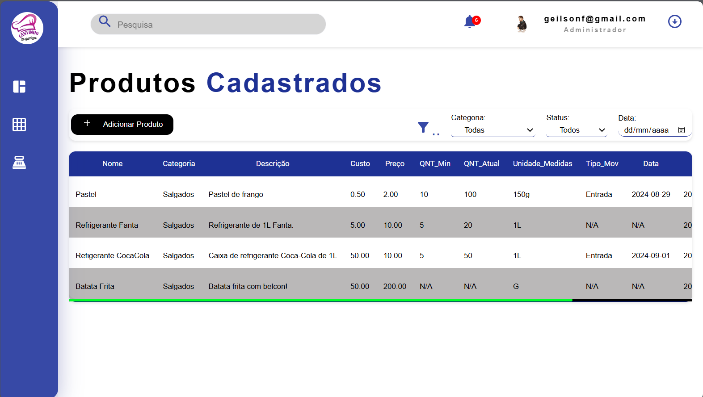
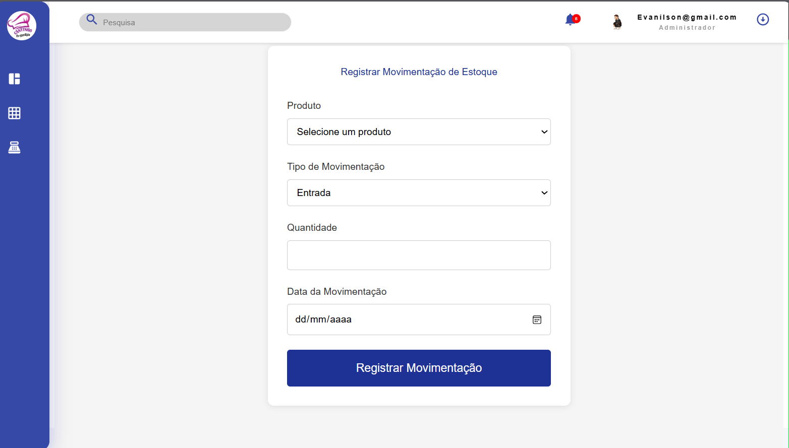
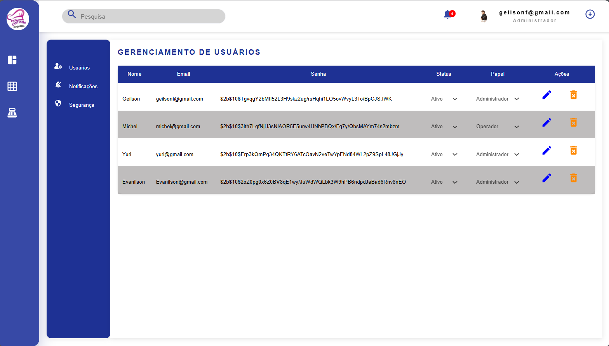
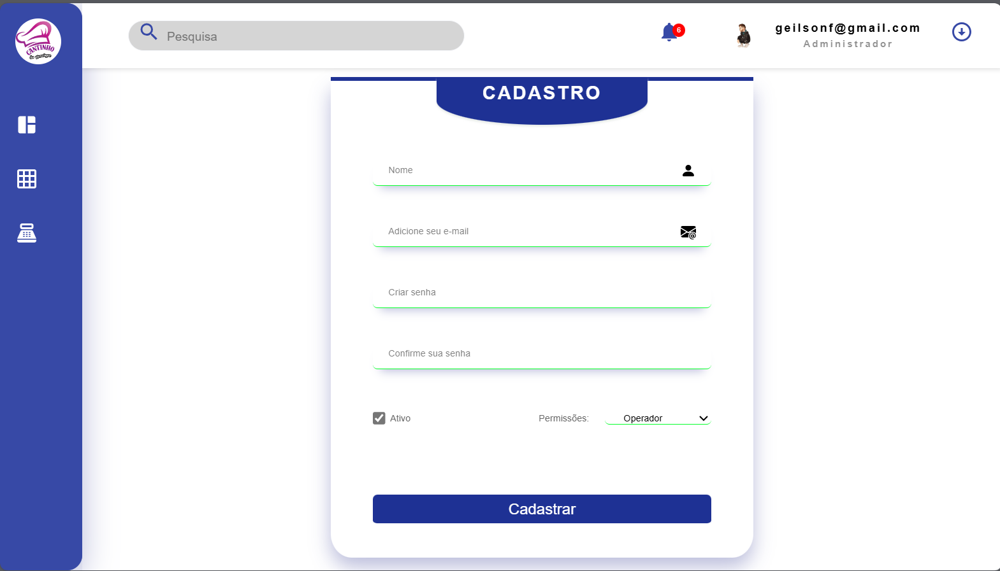

# Trabalho acadêmico de extensão - Projeto banco de dados!

## Tecnologias utilizadas!
<ul>
    <li>React</li>
    <li>PostgresSQL</li>
</ul>

## Front End do projeto

- Tela de login

- Tela de Home

- Tela de DasheBoard

- Tela de Estoque

- Tela de Cadastro de produtos 

- Tela de Cadastro de categorias

- Tela de Movimentaçao de caixa

- Tela de lista de usuarios

- Tela de Cadastro de usuario

